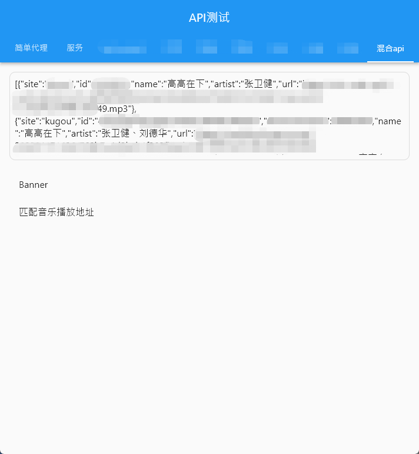

# MusicApi

## 可能很少更新，有问题的话提issues，看到会改的

## 该代码仅作技术交流,切勿用作商业用途

## 该API尚未稳定，在开发过程中可能存在重大更改，使用时请谨慎

## 感谢

[https://github.com/ziming1/NeteaseCloudMusicApi](https://github.com/ziming1/NeteaseCloudMusicApi)，

[https://github.com/Binaryify/NeteaseCloudMusicApi](https://github.com/Binaryify/NeteaseCloudMusicApi)，

纯本地请求，不需要购买服务器部署(想支持web的除外)

支持android，桌面，ios（理论支持，没做测试），web需要启用简单代理，将跨域接口转换为原生请求

搬运了NeteaseCloudMusicApi的代码，合并了部分缺失的接口(没做测试)，

千千音乐 FQ后可能无法访问播放地址，报403

以后有机会会合并其他平台的接口

## 其他说明

[网易云api](https://binaryify.github.io/NeteaseCloudMusicApi/#/)
这个我基本没有改，参数都是照抄的

具体请求测试可以参考demo，除了网易云所有的接口都做了测试，保证能用

## 网易 CloudMusicApi同步信息

版本: 65765edafeb17b4956d3408eff271659ce5b0255

日期: 2022/4/19 9:40:49

信息: 已经同步的接口时间

## 百度 MusicApi同步信息

版本: Android APP 8.3.0.4

日期: 2023/12/30 17:30:00

信息: 同步主要接口

## QQ MusicApi同步信息

版本:web

日期: 2023/12/30

信息: 大部分api,有其他需要Issues

## 咪咕 MusicApi同步信息

版本: Android APP 7.2.0

日期: 2023/6/02

信息: 整理了部分接口,部分接口使用2.0api(又不是不能用-_-),新版3.0有加密校验,有知道算法的可以Issues反馈一下

## 酷狗 MusicApi同步信息

版本: Web

日期: 2023/12/30

信息: 连猜带找，弄到了不少可用的api，基本能满足日常使用了

## 酷我 MusicApi同步信息

版本: Web

日期: 2023/12/30

信息: 连猜带找，弄到了不少可用的api，基本能满足日常使用了

## MyFreeMp3 MusicApi同步信息

版本: Web

日期: 2024/01/01

信息: 只有一个搜索，官网也没啥能用的api

## audiomack MyFreeMp3 MusicApi同步信息

版本: Web

日期: 2024/01/01

信息: 只做了搜索和获取播放链接，其他的暂时没弄

